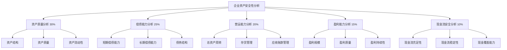

# 企业资产安全性分析指导文档

## 📋 文档概述

本指导文档基于tushare-query-mcp项目的财务数据查询能力，提供了一套完整的企业资产安全性分析框架。通过5大维度、20+关键指标的综合评估，帮助企业分析人员、投资者和管理者全面了解企业的资产安全状况。

### 🎯 适用场景
- **投资决策分析**：评估投资标的安全性
- **风险管理**：识别企业潜在财务风险
- **经营分析**：监控企业资产健康状况
- **信贷评估**：评估企业偿债能力
- **对标分析**：与同行业企业对比

### 🔧 技术基础
- **数据源**：基于tushare-query-mcp的14个API端点
- **财务报表**：利润表、资产负债表、现金流量表
- **分析工具**：3个MCP工具（query_stock_financials、get_available_financial_fields、validate_financial_fields）

---

## 🏗️ 分析框架总览

### 五大维度评估体系



### 综合评分模型

| 评分等级 | 分数区间 | 安全状况 | 建议行动 |
|---------|---------|---------|---------|
| 优秀 | 90-100分 | 资产安全性极高 | 积极投资 |
| 良好 | 80-89分 | 资产安全性较高 | 考虑投资 |
| 中等 | 70-79分 | 资产安全性一般 | 谨慎观察 |
| 较差 | 60-69分 | 资产安全性较低 | 规避风险 |
| 危险 | <60分 | 资产安全性差 | 立即警惕 |

---

## 📊 核心指标详解

### 1. 资产质量分析 (权重：30%)

#### 1.1 资产结构指标
- **总资产规模 (`total_assets`)**
  - 计算公式：直接取自资产负债表
  - 分析意义：反映企业整体规模和资源实力
  - 评价标准：规模适中且持续增长为佳

- **流动资产占比 (`c_cur_assets` / `total_assets`)**
  - 计算公式：流动资产 ÷ 总资产 × 100%
  - 分析意义：反映资产流动性结构
  - 评价标准：40%-70%为合理区间

- **固定资产占比 (`fix_assets` / `total_assets`)**
  - 计算公式：固定资产 ÷ 总资产 × 100%
  - 分析意义：反映企业重资产程度
  - 评价标准：根据行业特性差异较大

#### 1.2 资产质量指标
- **无形资产占比 (`int_assets` / `total_assets`)**
  - 计算公式：无形资产 ÷ 总资产 × 100%
  - 分析意义：反映企业轻资产运营能力
  - 评价标准：科技类企业可适当偏高

- **存货占比 (`cog_inv` / `total_assets`)**
  - 计算公式：存货 ÷ 总资产 × 100%
  - 分析意义：反映库存管理效率
  - 评价标准：越低越好，但需保障经营连续性

### 2. 偿债能力分析 (权重：25%)

#### 2.1 短期偿债能力
- **流动比率 (`c_cur_assets` / `c_cur_liab`)**
  - 计算公式：流动资产 ÷ 流动负债
  - 分析意义：短期偿债能力核心指标
  - 评价标准：1.5-2.5为理想区间

- **速动比率 ((`c_cur_assets` - `cog_inv`) / `c_cur_liab`)**
  - 计算公式：(流动资产 - 存货) ÷ 流动负债
  - 分析意义：更严格的短期偿债能力测试
  - 评价标准：1.0-2.0为理想区间

#### 2.2 长期偿债能力
- **资产负债率 (`total_liab` / `total_assets`)**
  - 计算公式：总负债 ÷ 总资产 × 100%
  - 分析意义：反映企业财务杠杆水平
  - 评价标准：40%-60%为合理区间

- **权益比率 (`total_equity` / `total_assets`)**
  - 计算公式：股东权益 ÷ 总资产 × 100%
  - 分析意义：反映企业资本结构稳健性
  - 评价标准：>40%为稳健

### 3. 营运能力分析 (权重：20%)

#### 3.1 资产周转效率
- **总资产周转率 (`total_revenue` / `total_assets`)**
  - 计算公式：营业收入 ÷ 总资产
  - 分析意义：反映资产使用效率
  - 评价标准：越高越好，需与行业对比

- **固定资产周转率 (`total_revenue` / `fix_assets`)**
  - 计算公式：营业收入 ÷ 固定资产
  - 分析意义：反映固定资产投资回报
  - 评价标准：越高越好

#### 3.2 存货管理效率
- **存货周转率 (`oper_cost` / `cog_inv`)**
  - 计算公式：营业成本 ÷ 存货
  - 分析意义：反映存货管理效率
  - 评价标准：越高越好，但需保障供应

### 4. 盈利能力分析 (权重：15%)

#### 4.1 盈利规模指标
- **营业收入 (`total_revenue`)**
  - 分析意义：反映企业市场地位和成长性
  - 评价标准：持续增长为佳

- **净利润 (`n_income_attr_p`)**
  - 分析意义：反映企业最终盈利能力
  - 评价标准：持续且稳定增长

#### 4.2 盈利质量指标
- **净利率 (`n_income_attr_p` / `total_revenue`)**
  - 计算公式：净利润 ÷ 营业收入 × 100%
  - 分析意义：反映企业盈利转化效率
  - 评价标准：>10%为优秀，5%-10%为良好

- **净资产收益率 (ROE) (`n_income_attr_p` / `total_equity`)**
  - 计算公式：净利润 ÷ 股东权益 × 100%
  - 分析意义：股东投资回报核心指标
  - 评价标准：>15%为优秀，10%-15%为良好

### 5. 现金流安全分析 (权重：10%)

#### 5.1 现金流充足性
- **经营活动现金流 (`net_cashflows_act`)**
  - 分析意义：反映主营业务造血能力
  - 评价标准：持续为正且增长

- **现金流动负债比 (`net_cashflows_act` / `c_cur_liab`)**
  - 计算公式：经营活动现金流 ÷ 流动负债
  - 分析意义：现金流偿债能力
  - 评价标准：>0.3为安全

#### 5.2 现金流稳定性
- **现金余额 (`c_eq_cash_bal`)**
  - 分析意义：反映企业现金储备水平
  - 评价标准：能够覆盖3-6个月支出为佳

---

## 🔧 数据获取规范

### 3.1 数据字段映射表

#### 资产负债表核心字段
| 分析维度 | 字段名称 | 字段含义 | 数据类型 |
|---------|---------|---------|---------|
| 资产规模 | `total_assets` | 总资产 | 数值型 |
| 流动资产 | `c_cur_assets` | 流动资产合计 | 数值型 |
| 非流动资产 | `c_ncur_assets` | 非流动资产合计 | 数值型 |
| 固定资产 | `fix_assets` | 固定资产 | 数值型 |
| 无形资产 | `int_assets` | 无形资产 | 数值型 |
| 存货 | `cog_inv` | 存货 | 数值型 |
| 总负债 | `total_liab` | 负债合计 | 数值型 |
| 流动负债 | `c_cur_liab` | 流动负债合计 | 数值型 |
| 非流动负债 | `c_ncur_liab` | 非流动负债合计 | 数值型 |
| 股东权益 | `total_equity` | 股东权益合计 | 数值型 |

#### 利润表核心字段
| 分析维度 | 字段名称 | 字段含义 | 数据类型 |
|---------|---------|---------|---------|
| 营业收入 | `total_revenue` | 营业总收入 | 数值型 |
| 营业成本 | `oper_cost` | 营业总成本 | 数值型 |
| 营业利润 | `operate_profit` | 营业利润 | 数值型 |
| 利润总额 | `total_profit` | 利润总额 | 数值型 |
| 净利润 | `n_income_attr_p` | 归属于母公司股东的净利润 | 数值型 |
| 每股收益 | `eps` | 基本每股收益 | 数值型 |

#### 现金流量表核心字段
| 分析维度 | 字段名称 | 字段含义 | 数据类型 |
|---------|---------|---------|---------|
| 经营现金流 | `net_cashflows_act` | 经营活动产生的现金流量净额 | 数值型 |
| 投资现金流 | `net_cashflows_inv_act` | 投资活动产生的现金流量净额 | 数值型 |
| 筹资现金流 | `net_cashflows_fin_act` | 筹资活动产生的现金流量净额 | 数值型 |
| 现金余额 | `c_eq_cash_bal` | 期末现金及现金等价物余额 | 数值型 |

### 3.2 数据获取策略

#### 完整字段列表
```python
comprehensive_fields = [
    # 资产负债表字段
    "total_assets", "c_cur_assets", "c_ncur_assets", "fix_assets", "int_assets",
    "cog_inv", "total_liab", "c_cur_liab", "c_ncur_liab", "total_equity",

    # 利润表字段
    "total_revenue", "oper_cost", "operate_profit", "total_profit",
    "n_income_attr_p", "eps",

    # 现金流量表字段
    "net_cashflows_act", "net_cashflows_inv_act", "net_cashflows_fin_act",
    "c_eq_cash_bal"
]
```

#### 数据获取示例
```python
# 获取贵州茅台最新财务数据
response = await query_stock_financials(
    ts_code="600519.SH",
    statement_type="balance",  # 资产负债表
    fields=comprehensive_fields,
    report_type=1  # 合并报表
)
```

### 3.3 数据质量要求

#### 完整性检查
- **关键字段缺失率 < 5%**：核心分析指标必须完整
- **时间连续性**：至少需要连续3年数据
- **报表一致性**：三表数据期间必须匹配

#### 异常值检测
- **数值合理性**：资产、负债等大额科目应为正数
- **逻辑一致性**：资产 = 负债 + 股东权益
- **趋势合理性**：避免异常大幅波动

---

## 📈 分析方法论

### 4.1 多维度综合评分模型

#### 标准化处理
所有原始指标需要经过标准化处理，转换为0-100分的标准分：

```python
def normalize_indicator(value, min_threshold, max_threshold, is_higher_better=True):
    """
    指标标准化函数
    :param value: 原始值
    :param min_threshold: 最小阈值
    :param max_threshold: 最大阈值
    :param is_higher_better: 是否越高越好
    :return: 标准化分数 (0-100)
    """
    if is_higher_better:
        normalized = (value - min_threshold) / (max_threshold - min_threshold) * 100
    else:
        normalized = (max_threshold - value) / (max_threshold - min_threshold) * 100

    return max(0, min(100, normalized))
```

#### 权重分配体系
| 分析维度 | 权重 | 核心指标数量 | 评分方法 |
|---------|------|-------------|---------|
| 资产质量分析 | 30% | 5个 | 加权平均 |
| 偿债能力分析 | 25% | 4个 | 加权平均 |
| 营运能力分析 | 20% | 3个 | 加权平均 |
| 盈利能力分析 | 15% | 4个 | 加权平均 |
| 现金流安全分析 | 10% | 3个 | 加权平均 |

#### 综合评分计算
```python
def calculate_comprehensive_score(scores, weights):
    """
    计算综合评分
    :param scores: 各维度评分字典
    :param weights: 各维度权重字典
    :return: 综合评分 (0-100)
    """
    total_score = 0
    total_weight = 0

    for dimension, score in scores.items():
        weight = weights.get(dimension, 0)
        total_score += score * weight
        total_weight += weight

    return total_score / total_weight if total_weight > 0 else 0
```

### 4.2 趋势分析方法

#### 同比增长率计算
```python
def calculate_yoy_growth(current_value, previous_value):
    """
    计算同比增长率
    """
    if previous_value == 0:
        return None
    return (current_value - previous_value) / previous_value * 100
```

#### 移动平均分析
- **3年移动平均**：平滑短期波动
- **复合增长率**：评估长期趋势
- **季节性调整**：识别周期性模式

### 4.3 行业对标分析

#### 行业基准获取
1. **同业公司筛选**：相同行业、相似规模
2. **行业均值计算**：剔除极端值后的平均值
3. **行业分位数**：25%、50%、75%分位数分布

#### 相对评分计算
```python
def calculate_industry_relative_score(company_value, industry_distribution):
    """
    计算行业相对评分
    :param company_value: 公司指标值
    :param industry_distribution: 行业分布 [p25, p50, p75]
    :return: 相对评分 (0-100)
    """
    p25, p50, p75 = industry_distribution

    if company_value >= p75:
        return 90 + 10 * (company_value - p75) / (p75 - p50) if p75 != p50 else 90
    elif company_value >= p50:
        return 60 + 30 * (company_value - p50) / (p75 - p50) if p75 != p50 else 60
    elif company_value >= p25:
        return 30 + 30 * (company_value - p25) / (p50 - p25) if p50 != p25 else 30
    else:
        return 30 * company_value / p25 if p25 != 0 else 0
```

---

## 🚨 风险评估体系

### 5.1 三级预警机制

#### 红色预警（高危风险）
**触发条件（任一满足）：**
- 资产负债率 > 80%
- 流动比率 < 0.8
- 净资产收益率 < 0%
- 经营活动现金流连续2年为负
- 综合评分 < 60分

**应对措施：**
- 立即停止新增投资
- 全面财务风险评估
- 制定应急方案

#### 黄色预警（中等风险）
**触发条件（任一满足）：**
- 资产负债率 70%-80%
- 流动比率 0.8-1.2
- 净资产收益率 0%-5%
- 经营活动现金流波动较大
- 综合评分 60-70分

**应对措施：**
- 加强监控频率
- 深入分析原因
- 制定改进计划

#### 绿色信号（安全状态）
**触发条件：**
- 资产负债率 < 60%
- 流动比率 > 1.5
- 净资产收益率 > 10%
- 现金流稳定为正
- 综合评分 > 80分

**维持策略：**
- 保持现有策略
- 定期监控
- 持续优化

### 5.2 风险矩阵分析

#### 风险概率-影响矩阵
```
            高影响
            │
    高风险  │  中风险
            │
低概率 ─────┼───── 高概率
            │
    低风险  │  中风险
            │
           低影响
```

#### 风险等级分类
| 风险等级 | 概率 | 影响 | 处理策略 |
|---------|------|------|---------|
| 重大风险 | 高 | 高 | 立即处理 |
| 高风险 | 高/中 | 中/高 | 优先处理 |
| 中风险 | 中 | 中 | 计划处理 |
| 低风险 | 低 | 低 | 接受风险 |

### 5.3 关键风险指标监控

#### 财务健康度指标
1. **偿债能力风险指标**
   - 利息保障倍数 < 1.5
   - 债务到期覆盖率 < 1.0
   - 现金到期债务比 < 0.5

2. **流动性风险指标**
   - 速动比率 < 0.8
   - 现金比率 < 0.2
   - 营运资金为负

3. **盈利能力风险指标**
   - 毛利率持续下降
   - 净利率低于行业平均50%
   - ROE持续下滑

4. **运营效率风险指标**
   - 应收账款周转天数延长
   - 存货周转率下降
   - 总资产周转率低于行业平均

---

## 📋 实施操作指南

### 6.1 分析前准备

#### 数据收集清单
- [ ] **基础信息**：公司全称、股票代码、行业分类
- [ ] **财务数据**：最近3年三大财务报表完整数据
- [ ] **行业数据**：同行业主要竞争对手数据
- [ ] **宏观环境**：行业发展趋势、政策环境

#### 工具准备
- [ ] **数据获取**：确认tushare-query-mcp服务正常运行
- [ ] **计算工具**：准备好计算环境（Python/Excel）
- [ ] **可视化工具**：图表生成工具
- [ ] **报告模板**：标准化分析报告模板

### 6.2 具体分析步骤

#### 第一步：数据获取与清洗
```python
# 1. 获取目标公司数据
async def get_company_data(ts_code, start_date="20220101", end_date="20241231"):
    # 获取资产负债表
    balance_data = await query_stock_financials(
        ts_code=ts_code,
        statement_type="balance",
        fields=comprehensive_fields,
        start_date=start_date,
        end_date=end_date
    )

    # 获取利润表
    income_data = await query_stock_financials(
        ts_code=ts_code,
        statement_type="income",
        fields=comprehensive_fields,
        start_date=start_date,
        end_date=end_date
    )

    # 获取现金流量表
    cashflow_data = await query_stock_financials(
        ts_code=ts_code,
        statement_type="cashflow",
        fields=comprehensive_fields,
        start_date=start_date,
        end_date=end_date
    )

    return balance_data, income_data, cashflow_data
```

#### 第二步：指标计算
```python
# 2. 计算各项分析指标
def calculate_financial_ratios(balance_data, income_data, cashflow_data):
    ratios = {}

    # 偿债能力指标
    ratios['current_ratio'] = balance_data['c_cur_assets'] / balance_data['c_cur_liab']
    ratios['quick_ratio'] = (balance_data['c_cur_assets'] - balance_data['cog_inv']) / balance_data['c_cur_liab']
    ratios['debt_ratio'] = balance_data['total_liab'] / balance_data['total_assets']

    # 盈利能力指标
    ratios['net_profit_margin'] = income_data['n_income_attr_p'] / income_data['total_revenue']
    ratios['roe'] = income_data['n_income_attr_p'] / balance_data['total_equity']

    # 营运能力指标
    ratios['total_asset_turnover'] = income_data['total_revenue'] / balance_data['total_assets']
    ratios['inventory_turnover'] = income_data['oper_cost'] / balance_data['cog_inv']

    # 现金流指标
    ratios['cash_to_current_debt'] = cashflow_data['net_cashflows_act'] / balance_data['c_cur_liab']

    return ratios
```

#### 第三步：评分计算
```python
# 3. 计算各维度评分
def calculate_dimension_scores(ratios, industry_benchmarks=None):
    scores = {}

    # 资产质量评分 (30%)
    asset_quality_score = calculate_asset_quality_score(ratios, industry_benchmarks)
    scores['asset_quality'] = asset_quality_score * 0.30

    # 偿债能力评分 (25%)
    solvency_score = calculate_solvency_score(ratios, industry_benchmarks)
    scores['solvency'] = solvency_score * 0.25

    # 营运能力评分 (20%)
    efficiency_score = calculate_efficiency_score(ratios, industry_benchmarks)
    scores['efficiency'] = efficiency_score * 0.20

    # 盈利能力评分 (15%)
    profitability_score = calculate_profitability_score(ratios, industry_benchmarks)
    scores['profitability'] = profitability_score * 0.15

    # 现金流安全评分 (10%)
    cashflow_score = calculate_cashflow_score(ratios, industry_benchmarks)
    scores['cashflow'] = cashflow_score * 0.10

    return scores
```

#### 第四步：风险评估
```python
# 4. 风险预警判断
def assess_risk_level(comprehensive_score, ratios):
    risk_factors = []

    # 检查关键风险指标
    if ratios['debt_ratio'] > 0.8:
        risk_factors.append("资产负债率过高")

    if ratios['current_ratio'] < 0.8:
        risk_factors.append("短期偿债能力不足")

    if ratios['roe'] < 0:
        risk_factors.append("净资产收益率为负")

    # 确定风险等级
    if comprehensive_score < 60 or len(risk_factors) >= 3:
        return "红色预警", risk_factors
    elif comprehensive_score < 70 or len(risk_factors) >= 1:
        return "黄色预警", risk_factors
    else:
        return "绿色安全", risk_factors
```

### 6.3 分析报告模板

#### 执行摘要模板
```markdown
## 📊 执行摘要

### 总体评价
- **企业名称**：[公司全称]
- **股票代码**：[股票代码]
- **分析期间**：[分析时间段]
- **综合评分**：[评分]/100 分
- **安全等级**：[优秀/良好/中等/较差/危险]
- **风险等级**：[绿色安全/黄色预警/红色预警]

### 核心发现
1. **主要优势**：[列举2-3个核心优势]
2. **关键风险**：[列举2-3个主要风险]
3. **投资建议**：[推荐/观望/规避]

### 关键指标速览
| 指标类别 | 当前值 | 行业平均 | 评价 |
|---------|-------|---------|------|
| 资产负债率 | XX% | XX% | [优秀/良好/一般/较差] |
| 流动比率 | X.X | X.X | [优秀/良好/一般/较差] |
| 净资产收益率 | XX% | XX% | [优秀/良好/一般/较差] |
```

#### 详细分析模板
```markdown
## 📈 详细分析

### 1. 资产质量分析 (得分: XX/100)
#### 1.1 资产结构分析
- **总资产规模**：XX亿元，同比[增长/下降]XX%
- **流动资产占比**：XX%，较[上期/同期][上升/下降]XX个百分点
- **固定资产占比**：XX%，处于行业[较高/中等/较低]水平

#### 1.2 资产质量评价
[详细分析段落，包括趋势分析、行业对比等]

### 2. 偿债能力分析 (得分: XX/100)
[类似结构的详细分析]

### 3. 营运能力分析 (得分: XX/100)
[类似结构的详细分析]

### 4. 盈利能力分析 (得分: XX/100)
[类似结构的详细分析]

### 5. 现金流安全分析 (得分: XX/100)
[类似结构的详细分析]
```

---

## 🚀 实施案例：贵州茅台分析框架

### 7.1 贵州茅台基本信息
- **公司全称**：贵州茅台酒股份有限公司
- **股票代码**：600519.SH
- **所属行业**：白酒制造
- **主营业务**：茅台酒及系列酒的生产与销售

### 7.2 分析参数设定
```python
# 贵州茅台分析配置
kweichow_m_analysis = {
    "ts_code": "600519.SH",
    "analysis_period": "3年",
    "industry_peers": ["000858.SZ", "000568.SZ", "600779.SH"],  # 五粮液、泸州老窖、水井坊
    "report_frequency": "quarterly",
    "baseline_comparison": True
}
```

### 7.3 行业特性调整
针对白酒行业的特点，需要调整以下权重：
- **品牌价值**：无形资产占比可适当放宽
- **库存价值**：白酒存货随时间增值，存货占比可适当放宽
- **现金流**：白酒行业现金流相对稳定，可适当降低权重

### 7.4 预期分析维度
1. **品牌资产价值**：评估茅台品牌作为核心资产的保值增值能力
2. **存货管理**：基酒储存和产品周转的特殊性分析
3. **渠道管控**：销售渠道稳定性和终端控制力
4. **盈利能力**：高端白酒定价权和盈利可持续性
5. **现金流质量**：预收款制度带来的现金流优势

---

## 📚 使用建议

### 8.1 分析频率建议
- **全面分析**：每年1次（结合年报发布）
- **季度跟踪**：每季度1次（跟踪关键指标变化）
- **风险监控**：月度检查（关注风险预警指标）

### 8.2 数据质量控制
- **数据来源统一**：使用相同的数据源确保可比性
- **会计政策一致**：关注会计政策变更对数据的影响
- **异常值处理**：对异常数据进行合理调整或标注

### 8.3 结果解读要点
- **避免单一指标判断**：综合多个维度进行分析
- **关注趋势变化**：重视指标的变动趋势而非单点数值
- **结合行业特点**：考虑行业特殊性对指标的影响
- **宏观环境影响**：关注宏观政策对行业的影响

### 8.4 持续优化建议
- **模型校准**：定期根据实际表现调整评分模型
- **行业细分**：针对不同细分行业建立专门的评价标准
- **因子扩充**：根据市场变化增加新的评价因子
- **技术升级**：利用AI和大数据技术提升分析精度

---

## 📞 技术支持

### 工具使用问题
- **tushare-query-mcp文档**：查看项目README和API文档
- **数据获取帮助**：参考项目示例代码
- **计算工具支持**：联系技术团队获取计算工具

### 分析方法咨询
- **模型优化建议**：根据实际使用反馈提供优化方案
- **行业特性调整**：针对特定行业提供专门的分析框架
- **风险预警定制**：根据需求定制专门的风险预警机制

---

*本指导文档基于tushare-query-mcp项目构建，持续更新中...*

**文档版本**：v1.0
**最后更新**：2024年
**维护团队**：tushare-query-mcp开发团队